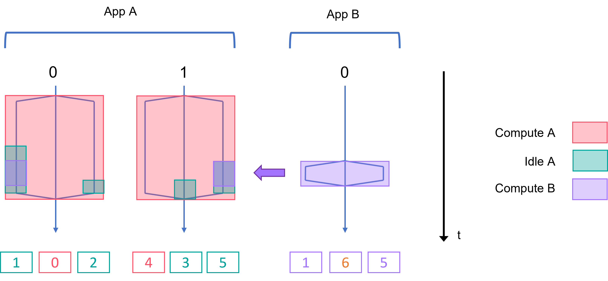

MOC
===

Goal
----

MOC is a work-in-progress tool to accelerate coupling of applications
using OpenMP.

MOC aims to take advantage of the idle time of an application *A* to
perform computations of a second application *B* on the same
resources. MOC targets applications using MPI and the OpenMP fork–join
model. The principle of MOC is to opportunistically re-bind threads to
cores that are left idle during OpenMP parallel regions thanks to
callbacks provided by the OMPT interface of OpenMP.

Installation
------------

Requirements: - compiler and runtime with OpenMP OMPT support - an
OpenMPI implementation

Manual installation::

    $ make install PREFIX=<destination_directory>

Usage
-----

1.  load environment: OpenMPI and compiler

2.  The general pattern to call MOC:

        $ export LD_PRELOAD=<path/to/moc>/lib/libmoc.so
        $ moc init
        $ <app1> &
        $ MOC_OPPORTUNIST=1 <app2> &
        $ wait
